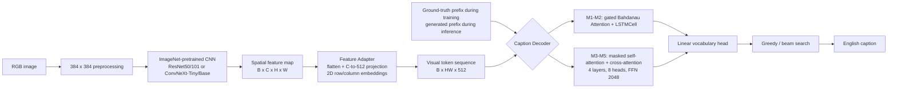

# 项目技术总结：Flickr30k Image Captioning

> 本文档面向“视觉大模型 / 多模态算法工程师”求职场景。所有结构、配置和指标均来自当前工作区中的源码、最终报告、训练日志、官方指标 JSON 与真实生成样例；找不到的结果明确标记为“未找到”。

## 1. 项目一句话简介

基于 PyTorch 从训练、生成到评估完整实现 Flickr30k 图像描述系统，使用统一的 CNN Encoder + Feature Adapter + Caption Decoder 框架对比 ResNet/ConvNeXt 与 Attention-LSTM/Transformer，并在最强 M5 模型上通过 CIDEr-style SCST 将测试集 CIDEr 从 0.5355 提升到 0.5468。

## 2. 项目背景

图像分类输出一个离散类别，而 Image Captioning 要在图像条件下生成一个可变长度自然语言序列。模型不仅需要识别人物、物体和场景，还要建模动作、属性、数量和对象关系，再把视觉语义组织成通顺句子。同一图像可能有多种合理描述，因此训练和评价都不能简单照搬分类任务。

本项目没有调用 BLIP、LLM 或其他现成 Captioning 系统。ImageNet 权重只负责初始化视觉骨干；图文接口、语言解码器、注意力模块、Transformer Decoder 和词表分类头均在 Flickr30k 上训练。项目的价值主要不在提出全新 SOTA 架构，而在完整实现视觉语言生成链路、设计逐步实验、处理序列级优化稳定性，并对指标和失败样例做证据化分析。

## 3. 完整架构

### 3.1 前向流程

1. 图像经过 Resize、张量化和 ImageNet Normalize；训练集额外使用随机水平翻转与轻量 ColorJitter。
2. CNN 去掉分类头，保留空间特征图，而不是只取全局分类向量。
3. Feature Adapter 将 `B x C x H x W` 展平为 `B x HW x C`，线性投影到 `d_model=512`，再加入可学习的行/列位置嵌入。
4. Decoder 接收视觉 token 和 caption 前缀，输出每个时间步对 9,469 个词表项的 logits。
5. 训练时使用真实前缀；推理时使用模型自己的历史输出，直至生成 `<eos>` 或达到 `max_len=32`。

### 3.2 Encoder

| Encoder | 实现 | 输出通道 | 预训练方式 | 对应实验 |
| --- | --- | ---: | --- | --- |
| ResNet50 | `torchvision.models.resnet50` 去掉 avgpool/fc | 2048 | ImageNet 默认或本地官方权重 | M0、M1 |
| ResNet101 | `torchvision.models.resnet101` 去掉 avgpool/fc | 2048 | ImageNet 默认或本地官方权重 | M2、M3 |
| ConvNeXt-Tiny | `torchvision.models.convnext_tiny().features` | 768 | ImageNet 默认或本地官方权重 | M4 |
| ConvNeXt-Base | `torchvision.models.convnext_base().features` | 1024 | ImageNet 默认或本地官方权重 | M5、M5+SCST |

`CNNEncoder.freeze()` 冻结整个视觉骨干；`unfreeze_last_stage()` 先全部冻结，再只解冻 `backbone[-1]`。项目还实现了 ConvNeXt-Small 构造分支，但 M0-M5 实验表中没有使用它。

### 3.3 Feature Adapter

Feature Adapter 解决两个问题：一是 ResNet、ConvNeXt 输出通道数不同，二是文本 Decoder 需要 token 序列而不是四维特征图。它将每个空间网格点映射为 512 维视觉 token，并用 `row_embed + col_embed` 保留二维位置。这样可以让不同 Encoder 共享同一 Decoder 接口，减少结构对比中的额外变量。

384 输入配合 stride-32 骨干通常得到 12 x 12 网格，即 144 个视觉 token。Adapter 的位置嵌入上限为 32 x 32。

### 3.4 Attention-LSTM Decoder

M1/M2 先对视觉 token 做平均池化，用两个线性层初始化 LSTM 的 `h` 和 `c`。每个时间步使用 Bahdanau additive attention：将视觉 token 和当前隐状态投影到同一 attention 空间，计算 softmax 权重并加权求和。随后用 `sigmoid(f_beta(h))` 门控视觉上下文，将上下文与词嵌入拼接后送入 `LSTMCell`，最后由线性层预测下一词。

### 3.5 Transformer Decoder

M3-M5 使用 PyTorch 原生 `nn.TransformerDecoder`，而不是 Hugging Face Transformers。模型配置为 4 层、8 个注意力头、`d_model=512`、FFN 维度 2048、dropout 0.1、Pre-LN。文本侧使用可学习词嵌入和位置嵌入；严格上三角 causal mask 防止访问未来 token；cross-attention 将文本状态与视觉 token 对齐；padding mask 屏蔽 `<pad>`。

## 4. 数据集与处理

### 4.1 数据划分

`captions.txt` 通过 `csv.DictReader` 读取，要求包含 `image` 和 `caption` 两列。代码先过滤不存在的 JPG，再对排序后的图像名用 seed 42 打乱，按图像级 8:1:1 划分。图像级划分可防止同一图像的五条 caption 分散到不同集合。

最终报告记录：

- 总图像数：31,783。
- Train：25,426 张，约 127,130 个 image-caption pair。
- Validation：3,178 张。
- Test：3,179 张。
- 每张图像通常有 5 条人工英文参考描述。

当前工作区没有 `Flickr30k/`、`splits.json` 或 `vocab.json`，因此这些数量无法从原始数据文件再次独立统计；但最终报告、优化日志、配置和 3,179 行测试预测文件互相吻合。

### 4.2 Vocabulary / Tokenizer

- Tokenizer：先转小写，再用正则 `[a-z0-9]+(?:'[a-z]+)?` 提取英文词、数字和简单撇号形式。
- 词表只使用训练集 caption 构建，避免验证/测试信息泄漏。
- `min_freq=3`，`max_vocab_size=12000`。
- 最终报告记录实际词表大小为 9,469。
- 特殊 token 顺序为 `<pad>`, `<bos>`, `<eos>`, `<unk>`。
- 编码时加 BOS/EOS；未知词映射到 UNK；超过 32 token 时截断并强制末位为 EOS。
- Collate 阶段用 `<pad>` 动态补齐 batch 内序列。

这是一套 word-level tokenizer，不是 BPE、WordPiece 或 SentencePiece。它实现简单，但长尾词、词形变化和开放词汇能力弱于现代 VLM 常用的子词 tokenizer。

### 4.3 图像预处理与增强

主线当前实现为 direct resize：

- Train：`Resize(384,384)`、`RandomHorizontalFlip(p=0.5)`、`ColorJitter(0.15, 0.15, 0.1)`、`ToTensor`、ImageNet Normalize。
- Validation/Test：`Resize(384,384)`、`ToTensor`、ImageNet Normalize。

代码中保留了 `ResizeLongSideAndPad` 和一段已注释的 resize-pad 流程。该消融在 ConvNeXt-Tiny 上接近 M4-lrB，但在 ConvNeXt-Base 上低于 direct resize，因此没有进入最终主线。

## 5. 训练、验证、测试与生成

### 5.1 Teacher Forcing 与交叉熵

对 caption `[<bos>, y1, ..., yT, <eos>]`：

- Decoder 输入：去掉最后一项；
- 监督目标：去掉第一项；
- Loss：带 `label_smoothing=0.1` 的交叉熵，忽略 `<pad>`。

\[
\mathcal L_{CE}=-\sum_t\log p_\theta(y_t^*\mid y_{<t}^*,I)
\]

这就是 Teacher Forcing。它能并行且稳定地学习条件语言模型，但推理时前缀来自模型自身，一旦前面预测错误，后续输入分布会偏离训练分布，即 exposure bias。

### 5.2 两阶段迁移学习

1. Stage 1：冻结完整 ImageNet Encoder，只训练 Adapter + Decoder。
2. Stage 2：解冻 Encoder 最后一个 stage，以区别于新模块的小学习率进行微调。
3. 每个阶段重新构建 AdamW 和 warmup-cosine scheduler。
4. 使用 weight decay `1e-4`、warmup 1,000 steps、梯度裁剪 1.0 和 CUDA AMP。
5. 固定轮数训练，不做 early stopping；持续保存 `last.pt`，并按最低 validation CE loss 保存 `best.pt`。

需要注意，早期 M1-M4 主实验的配置文件没有记录独立 stage-2 LR 字段；其日志显示 Decoder 在 stage 2 仍从约 `3e-4` 调度。M4-lrA/lrB 和 M5 才显式记录更低的 stage-2 学习率。新文档不把后期代码默认值倒推为早期实验事实。

### 5.3 自回归生成

- Greedy：每一步取 `argmax`，用于快速推理和 SCST baseline。
- Beam Search：每个前缀保留 top-k 个下一词候选，累计 log-prob，并按 `log p(y|I) / |y|^alpha` 排序。
- 生成终止：全部序列产生 `<eos>`，或达到最大长度 32。
- Transformer 推理每一步基于完整前缀重新计算；LSTM 的 batch greedy 分支递推状态，通用单图 beam 分支同样按前缀重算，以统一 Decoder 接口。

Beam Search 确实被用于正式实验：工作区存在 beam5、beam7、beam9 的官方指标与预测文件。Top-k 没有用于最终确定性推理，只在 SCST 随机采样中使用；最终安全 SCST 设置为 Top-k=50。

### 5.4 Validation / Test

- Validation loss：按 image-caption pair 计算 Teacher-Forced CE。
- 生成评价：按图像取样，每张图只生成一个 hypothesis，对齐该图的 5 条 references。
- 交叉熵阶段按最低 validation loss 选 checkpoint。
- SCST 阶段按最高 validation CIDEr 选 checkpoint。
- 解码参数先在 validation 搜索，再到 test 报告。
- 正式结果用 `pycocoevalcap`；轻量实现仅适合调试，不能与 official 数字混用。

## 6. M1-M5 + SCST 实验路线

### 6.1 主实验表

| 模型版本 | Encoder | Decoder | 训练策略 | BLEU-4 | CIDEr | 主要变化 |
| --- | --- | --- | --- | ---: | ---: | --- |
| M0 | ResNet50 | Vanilla LSTM | CE | 未找到 | 未找到 | 代码中的参考模型；无可信评估文件 |
| M1 | ResNet50 | Attention LSTM | CE；batch 64；18+12 epochs | 0.2049 | 0.4664 | 正式 baseline |
| M2 | ResNet101 | Attention LSTM | CE；batch 64；18+12 epochs | 0.2104 | 0.4670 | 只加深 ResNet，CIDEr +0.0006 |
| M3 | ResNet101 | Transformer | CE；batch 48；22+13 epochs | 0.2049 | 0.4690 | 更换 Decoder，CIDEr +0.0020；并非严格全局单变量 |
| M4 | ConvNeXt-Tiny | Transformer | CE；batch 48；22+13 epochs | 0.2182 | 0.4940 | 更换现代 CNN backbone，CIDEr +0.0250 |
| M4-lrB | ConvNeXt-Tiny | Transformer | CE；stage2 LR=3e-5/5e-6 | 0.2228 | 0.5010 | 调低 Decoder/Encoder stage-2 LR |
| M5 | ConvNeXt-Base | Transformer | CE；batch 32；12+8 epochs；stage2 LR=5e-5/1e-5 | 0.2304 | 0.5355 | 强视觉骨干与配套训练设置 |
| M5+SCST | ConvNeXt-Base | Transformer | SCST + 0.2 CE；3 epochs；Top-k 50 | **0.2342** | **0.5468** | 从 token-level CE 转向 sentence-level reward 微调 |

所有表内数值来自 `_official.json`。M1-M3 记录的正式测试是 beam5/lp0.7；M4 主结果是 beam5/lp0.7；M4-lrB 是 beam7/lp0.7；M5 是 beam7/lp0.8；M5+SCST 最终是 validation-selected beam9/lp0.9。因此本表体现真实实验演进，但不应宣称每行都处于完全相同的训练和解码超参数下。

### 6.2 补充消融

| 实验 | BLEU-4 | METEOR | ROUGE-L | CIDEr | 结论 |
| --- | ---: | ---: | ---: | ---: | --- |
| M4 direct resize | 0.2182 | 0.2098 | 0.3941 | 0.4940 | 主线 M4 |
| M4-lrB | 0.2228 | 0.2103 | 0.3958 | 0.5010 | 更低 stage-2 LR 有小幅收益 |
| M4 resize-pad | 0.2190 | 0.2111 | 0.3972 | 0.5008 | 接近 lrB，但无法证明稳定收益 |
| M5 direct resize | 0.2304 | 0.2179 | 0.4055 | 0.5355 | SCST 前置强基线 |
| M5 resize-pad | 0.2264 | 0.2157 | 0.4025 | 0.5313 | Base 上反而下降 |
| M5 temporary 9:0.5:0.5 split | 0.2283 | 0.2172 | 0.4034 | 0.5368 | 测试集更小，收益接近划分波动；不作为主结果 |
| M5+SCST beam7/lp0.8 | 0.2342 | 0.2161 | 0.4056 | 0.5439 | SCST 已有收益 |
| M5+SCST beam9/lp0.9 | 0.2342 | 0.2174 | 0.4071 | 0.5468 | validation-selected 最终结果 |

复现边界：resize-pad 是通过当时的数据预处理代码状态切换，`config.json` 没有显式 `preprocess` 字段；临时 9:0.5:0.5 实验依赖当时 `splits.json` 的内容，而其配置仍显示默认 0.8/0.1。两组实验的 provenance 不够自包含，因此只能作为辅助结论。

## 7. SCST 原理与项目中的具体实现

SCST 用模型自身的 greedy 输出作为 baseline。对于同一图像：

\[
A=R(y^{sample})-R(y^{greedy})
\]

\[
\mathcal L_{SCST}=-\operatorname{mean}\left[A\cdot\frac{1}{T}\sum_t\log p_\theta(y_t^{sample})\right]
\]

最终安全版本采用：

- 初始化：`outputs/m5_convnext_base_resize384_lra/best.pt`。
- SCST 采样单位：image-level，而不是 image-caption pair。
- Greedy baseline：关闭梯度，用当前模型贪心生成。
- Sample：temperature=0.8，Top-k=50 的随机采样；保存每个有效 token 的 log-prob。
- Reward：使用训练集全部图像 references 预计算文档频率的 CIDEr-style TF-IDF 1-4 gram cosine score。
- Advantage：`sample_reward - greedy_reward`，并在 batch 内标准化。
- 序列 log-prob：仅统计 EOS 前有效 token，并按 token 数做长度归一化。
- 混合目标：`L_SCST + 0.2 * L_CE`。
- 可训练部分：冻结 CNN；训练 Adapter + Transformer Decoder。
- 超参数：3 epochs、batch 16、LR `2e-6`、weight decay `1e-4`、grad clip 1.0、AMP。
- 模型选择：每轮用 official backend 做 validation generation，按 validation CIDEr 保存 best。

项目内 reward 与正式 CIDEr 的角色不同：前者为了训练速度自行实现，后者由 `pycocoevalcap.cider.Cider` 计算。把它写成 “CIDEr-style reward + official CIDEr evaluation” 比“直接反向传播 official CIDEr”更准确。

## 8. BLEU / CIDEr 等指标含义

| 指标 | 关注点 | 在本项目中的解释 |
| --- | --- | --- |
| BLEU-1/2/3/4 | 候选与参考的 clipped n-gram precision，并带长度惩罚 | BLEU-4 对连续四元词组匹配严格，能反映局部表达一致性，但对合理改写不够宽容 |
| METEOR | 词级对齐、召回与片段连续性 | 项目正式值来自 pycocoevalcap/Java METEOR；SCST 后略降，说明指标间有权衡 |
| ROUGE-L | 最长公共子序列 | 衡量候选与参考的顺序结构重合 |
| CIDEr | TF-IDF 加权的 1-4 gram 与多参考共识 | 更贴合 Image Captioning；本项目用它选择 SCST checkpoint 和主要解码参数 |

轻量后端自行实现了 BLEU、精确词匹配版 METEOR、ROUGE-L 和简化 CIDEr。其数值明显高于 official 后端，例如 M1 轻量 CIDEr 0.7074、official CIDEr 0.4664；两者不能直接比较。

## 9. 最终结果

最终指标文件：`outputs/m5_convnext_base_resize384_lra_scst_cider_safe/metrics_test_beam9_lp0p9_official.json`。

| BLEU-1 | BLEU-2 | BLEU-3 | BLEU-4 | METEOR | ROUGE-L | CIDEr |
| ---: | ---: | ---: | ---: | ---: | ---: | ---: |
| 0.6474 | 0.4640 | 0.3307 | **0.2342** | 0.2174 | **0.4071** | **0.5468** |

相较 M5 CE 基线：

- CIDEr：0.5355 -> 0.5468，绝对提升 0.0113，约相对提升 2.1%。
- BLEU-4：0.2304 -> 0.2342。
- ROUGE-L：0.4055 -> 0.4071。
- METEOR：0.2179 -> 0.2174，轻微下降。

可信表述是“CIDEr 导向的 SCST 提升了 CIDEr、BLEU-4 和 ROUGE-L，但不同指标存在轻微权衡”。不能表述为 SOTA，也不能表述为所有指标全面提升。

## 10. 失败实验和踩坑

### 10.1 初版 SCST 崩溃

第一次 SCST 使用 image-caption pair 数据集，同一图像因约 5 条参考描述在一个 epoch 中被 RL 更新约 5 次，导致更新强度过大。该运行的 validation CIDEr 从正常量级迅速跌到 0.0337，并进一步降到约 0.0175。日志还记录过中断保存产生 0 字节 checkpoint 的历史问题。

修复包括：改为 image-level dataset、checkpoint 临时文件原子替换、模型权重默认不保存 optimizer、更小 LR、CE 权重从 0.05 提高到 0.2、temperature 0.8、Top-k 50、advantage normalization 和长度归一化 log-prob。当前失败实验目录里的文件并非 0 字节，但指标已经证明该 run 不应分发或用于最终推理。

### 10.2 Resize-pad 收益不稳定

保持长宽比看似更合理，但 padding 会引入边界，并缩小非正方形图像中的有效主体尺度。它在 M4 上接近最优学习率变体，却在 M5 上低于 direct resize，因此没有作为最终方案。

### 10.3 修改数据划分不能当作算法收益

9:0.5:0.5 划分将更多图像放入训练，但验证/测试集合更小。CIDEr 只从同类 M5 结果约 0.5313 变化到 0.5368，且样本分布已改变，不能作为公平主结果。最终恢复 8:1:1。

### 10.4 更深 Encoder / 更强 Decoder 不保证单独有效

M1->M2 CIDEr 仅 +0.0006；M2->M3 仅 +0.0020。M3 的最佳 validation loss 还高于 M2。结果说明模型容量或结构名称本身不是充分条件，视觉 token 质量、数据规模与训练策略会共同限制收益。

### 10.5 训练日志与配置 provenance

- `outputs/m1_resnet50_attlstm/train_log.csv` 曾串接三次运行，共 70 行；可靠的正式运行是 30 行版本，best epoch=13、best val loss=3.757296。仓库整理时保留清洗后的日志，原始串接文件不入 Git。
- 早期配置未记录 stage-2 独立 LR，不能用当前代码默认值反推旧实验。
- Resize-pad 与临时 split90 依赖外部代码/文件状态，配置不完全自包含。
- `set_seed(42)` 固定了主要随机源，但启用了 `cudnn.benchmark=True`，不保证位级确定性。

## 11. Error Analysis

最终十个样例来自 M5+SCST、beam9/lp0.9、seed 42。生成句长度为 7-12 个空格分词 token，平均约 10；问题不是普遍“不成句”，而是语义常被压缩成安全模板。

| 图像 | 真实参考核心信息 | 模型生成 | 主要错误 |
| --- | --- | --- | --- |
| `309771854.jpg` | 两名宗教人士站在教堂台阶 | `a man in a black robe is talking on a cellphone` | 人数从 2 变 1；凭空生成 cellphone/talking |
| `7420874336.jpg` | 两名男子在船上/挥手 | `three men are standing on the deck of a ship` | 人数错误；遗漏挥手 |
| `5968404576.jpg` | 两名女子进行武术/摔跤比赛 | `two men are competing in a martial arts tournament` | 性别错误；事件类别基本正确 |
| `4717895395.jpg` | 两个孩子用铲子挖土 | `two children are playing in the dirt` | 主体/场景正确，但动作与工具被简化 |
| `4959071809.jpg` | 多人在建筑前拍摄婚礼照片 | `two men are standing in front of a white building` | 人数、角色和拍照关系被压缩为模板 |
| `4030022254.jpg` | 两个孩子在餐厅听乐队并画画 | `a group of people are sitting around a table playing instruments` | 把听音乐者误作演奏者；主体数量/角色关系错误 |
| `4589055346.jpg` | 瑞士足球女球迷穿红白服装并微笑 | `a woman in a red shirt and a red hat is smiling` | 基本正确；足球与国旗细节缺失 |
| `5869269064.jpg` | 女子做体操/舞蹈/瑜伽姿势 | `a woman in a blue leotard is jumping on a trampoline` | 细粒度动作错误；hallucinate trampoline |
| `23016091.jpg` | 网球运动员挥手/举手微笑 | `a woman in a white tank top is raising her arms` | 姿态正确；运动身份、挥手对象和表情缺失 |
| `4234228276.jpg` | 男子在桌旁指向远处，背景有啤酒瓶 | `two men are sitting at a table drinking beer` | 把背景物体转成饮酒动作；遗漏指向关系 |

### 11.1 错误类型与可能来源

| 错误类型 | 实际观察 | 可能来源 |
| --- | --- | --- |
| 人数错误 | 2->1、2->3、“多人”->2 | stride-32 网格与全图 caption 监督缺少显式实例分离/计数目标；常见数词先验 |
| 性别错误 | women -> men | 细粒度视觉属性不足、遮挡/姿态、训练语料性别词频偏差 |
| 动作细节错误 | 体操->跳 trampoline，指向->喝酒 | 静态图像动作本就有歧义；无区域/关系/姿态辅助监督；Decoder 倾向常见搭配 |
| 对象关系错误 | 听乐队的人被写成演奏者 | Adapter 保留粗空间位置，但没有显式对象图、主体-谓词-宾语约束或区域 grounding |
| Hallucination | cellphone、trampoline、drinking | 语言先验压过不确定视觉证据；Teacher Forcing 的 exposure bias；beam search 偏好高概率流畅句 |
| 过短/模板化 | `two ... are ...`、`a woman in ... is ...` 反复出现 | Flickr30k 规模有限；CE 与 beam search 偏向安全高频句式；CIDEr reward 也偏好参考 n-gram |
| 细节遗漏 | 铲子、挥手、国旗、网球身份 | 空间下采样和图像级监督弱化小物体/局部属性；最大化共识指标会奖励概括性描述 |

这些是从样例和结构出发的合理诊断，不是经过独立因果消融证明的结论。更可靠的后续验证包括：按人数/动作/关系建立分组测试集，加入区域级 grounding 或检测辅助损失，比较 greedy/beam/多样性解码，并进行人工准确性评分。

## 12. 我的实际工作与贡献

从仓库证据可以支持的个人工作包括：

1. 搭建 Flickr30k 图像级划分、训练词表、图像增强、Pair/Eval/SCST 三类 Dataset 与 Collate 流程。
2. 设计统一 Encoder-Adapter-Decoder 抽象，接入四种实际实验骨干，并实现普通 LSTM、Attention-LSTM、Transformer 三类 Decoder。
3. 实现 Teacher-Forced CE 训练、分组学习率、冻结/解冻、warmup-cosine、AMP、梯度裁剪和原子 checkpoint。
4. 实现 greedy、随机采样、Top-k、beam search、length penalty、验证集解码参数搜索和样例导出。
5. 实现轻量指标、接入 `pycocoevalcap` official 指标，并区分训练 reward 与正式评价。
6. 在 M5 上实现 SCST，定位 image-caption pair 导致的过强 RL 更新和 checkpoint 保存问题，并用 image-level 数据、CE anchor、advantage normalization 等稳定训练。
7. 完成 M1-M5、学习率、预处理、数据划分、解码参数与 SCST 的实验分析和真实错误归因。

不应声称的内容：没有训练视觉骨干的 ImageNet 预训练权重；没有使用大规模图文预训练；没有超过公开 SOTA；没有实现现代通用 VLM 或 LLM。

## 13. 真正使用过的技术栈

| 技术/库 | 是否真实使用 | 证据与用途 |
| --- | --- | --- |
| Python | 是 | 全部训练、评估与工具脚本 |
| PyTorch | 是 | 模型、Loss、AdamW、AMP、DataLoader、checkpoint |
| torchvision | 是 | ResNet/ConvNeXt 与 transforms |
| OpenCV / `cv2` | 否 | 源码和配置中未找到 import |
| PIL / Pillow | 是 | 读图、RGB 转换、resize-pad 辅助实现 |
| NumPy | 是 | 随机种子设置 |
| Pandas | 否 | CSV 通过标准库 `csv` 读写 |
| timm | 否 | Backbone 来自 torchvision |
| Hugging Face Transformers | 否 | Transformer 来自 `torch.nn.TransformerDecoder` |
| TensorBoard | 否 | 日志写入 CSV，曲线由 Matplotlib 绘制 |
| tqdm | 是 | 训练、验证和生成进度条 |
| NLTK | 否 | Tokenizer 为自定义正则；正式指标走 pycocoevalcap |
| pycocoevalcap | 是 | Official BLEU/METEOR/ROUGE-L/CIDEr |
| Matplotlib | 是 | Loss、指标与 SCST 曲线 |
| python-docx | 仅报告工具 | 用于课程报告 DOCX 修改，不属于模型运行时依赖 |
| Java | Official METEOR 需要 | `pycocoevalcap.meteor` 外部运行时 |
| CUDA AMP | 是 | GPU 混合精度训练 |
| Git LFS | 仓库发布使用 | 跟踪 `.pt` / `.pth` 大文件 |

## 14. 适合简历的 4 条 Bullet

- 基于 PyTorch 构建 Flickr30k 端到端图像描述系统，完成图像级防泄漏划分、9.5K 训练词表、CNN 视觉 token 化、Attention-LSTM/Transformer 自回归解码及官方多参考 Caption 评估链路。
- 设计 M1-M5 逐步实验，对比 ResNet50/101、ConvNeXt-Tiny/Base 与 Attention-LSTM/Transformer；官方测试 CIDEr 从 M1 的 0.4664 提升到 M5 的 0.5355，并通过受控实验定位视觉表征为主要瓶颈。
- 实现基于 greedy self-critical baseline 和 CIDEr-style reward 的 image-level SCST，结合 Top-k 采样、CE anchor、advantage/序列长度归一化，将最终 CIDEr 提升至 0.5468、BLEU-4 提升至 0.2342。
- 完成 beam search 与 length-penalty 验证集调参、CSV/JSON 实验追踪、原子 checkpoint 和定性错误分析，定位人数、性别、动作关系与 hallucination 等视觉语言生成问题。

## 15. 20 个技术面可能追问的问题与回答思路

### Q1. 这个任务比 CNN 图像分类多了什么？

回答思路：分类学习 `p(class|image)`，输出固定类别；Captioning 学习 `p(sequence|image)`，需要视觉表示、跨模态条件建模、语言语法、可变长自回归生成和多参考序列评价。错误还会沿生成前缀累积。

### Q2. 为什么必须按图像而不是按 caption 划分？

回答思路：每图约 5 条 caption。若按 pair 随机划分，同一图像可能出现在训练和测试，模型见过完全相同的视觉输入，产生严重泄漏。项目先按 image name 划分，再展开 caption pair。

### Q3. 词表如何构建，为什么只用训练集？

回答思路：小写正则分词，统计训练 caption 词频，保留频次至少 3 的词并限制总词表 12K，实际 9,469。只用训练集避免 validation/test 词分布泄漏，长尾词使用 `<unk>`。

### Q4. Feature Adapter 为什么必要？

回答思路：不同 CNN 的通道数是 768/1024/2048，Decoder 统一要求 512。Adapter 完成空间展平、线性投影和二维位置注入，使 Backbone 可替换、Decoder 接口不变，也保留 cross-attention 需要的局部 token。

### Q5. 为什么不用 CNN 全局池化向量？

回答思路：全局向量会丢失局部实体和空间关系。项目保留 HxW token，Attention-LSTM 可逐词聚合区域，Transformer 可用 cross-attention 根据文本前缀读取不同视觉位置。

### Q6. Attention-LSTM 的注意力具体怎么计算？

回答思路：将每个视觉 token 与当前 hidden state 分别线性投影，求和后 tanh，再映射为标量并 softmax，得到区域权重；加权视觉上下文经过 sigmoid gate 后与词嵌入拼接送入 LSTMCell。

### Q7. Transformer Decoder 如何同时建模语言和图像？

回答思路：masked self-attention 只看已生成文本前缀；cross-attention 的 query 来自文本状态，key/value 来自视觉 token；FFN 做逐位置变换。causal mask 防止 Teacher Forcing 期间看到未来词。

### Q8. Teacher Forcing 是什么，Exposure Bias 从哪里来？

回答思路：训练时每步输入真实前缀，推理时输入模型前一步输出。模型从未充分学习如何从自身错误前缀恢复，因此早期错误会改变后续条件分布。SCST 在自由运行生成上优化，能部分缩小这一差异，但不会完全解决。

### Q9. 为什么采用冻结后再解冻的两阶段训练？

回答思路：Flickr30k 较小，从一开始全量微调可能破坏 ImageNet 表征并过拟合；始终冻结又不能适应 Captioning。先训练新模块，再只微调最后 stage，是稳定性与任务适配之间的折中。

### Q10. Loss 为什么用 label smoothing？

回答思路：主损失是忽略 PAD 的 token-level Cross Entropy。0.1 label smoothing 减少对单一参考词的过度自信，适合“一图多种合理描述”的场景，也有助于正则化。

### Q11. Optimizer 和 Scheduler 如何设置？

回答思路：AdamW + weight decay 1e-4；Encoder 与 Adapter/Decoder 分 param group，允许预训练模块更小 LR；每阶段使用 1,000-step linear warmup 后 cosine decay；grad clip 1.0，GPU 使用 AMP。

### Q12. Beam Search 如何实现，Length Penalty 有什么作用？

回答思路：每轮对每个 beam 扩展概率最高的若干 token，累计 log-prob，保留归一化分数最高的 beam。直接求和偏好短句，除以 `length^alpha` 调节长度偏置。项目在 validation 搜索参数，避免 test 调参。

### Q13. Top-k 在哪里使用？和 Beam Search 有什么不同？

回答思路：Top-k=50 只用于 SCST policy sampling，从前 50 个 token 的归一化分布中随机采样，以产生可比较的序列；Beam Search 是确定性的高概率搜索，用于正式生成。二者目的不同。

### Q14. 为什么要同时报告 BLEU、METEOR、ROUGE-L、CIDEr？

回答思路：每个指标偏好不同。BLEU 强调 precision，METEOR 更重召回/对齐，ROUGE-L 看序列公共子序列，CIDEr 看多参考 TF-IDF 共识。项目中 SCST 提升 CIDEr 但 METEOR 略降，正说明单指标不够。

### Q15. 项目训练用的 CIDEr reward 和正式 CIDEr 一样吗？

回答思路：不完全一样。训练 reward 是为速度实现的 CIDEr-style 1-4 gram TF-IDF cosine score；正式指标用 pycocoevalcap。应明确优化的是近似 reward，验证/测试报告的是 official CIDEr。

### Q16. SCST 梯度从哪里来？Reward 本身不可微怎么办？

回答思路：用 REINFORCE。Reward 只形成 detached advantage；梯度通过采样序列各 token 的 log-prob 传回网络。若采样 reward 高于 greedy baseline，负损失会提高该序列概率；反之降低。

### Q17. 第一次 SCST 为什么崩溃，如何定位？

回答思路：Pair Dataset 让每图每 epoch 按 5 条参考重复 RL 更新，等价更新过强；日志显示 validation CIDEr 降到约 0.02-0.03。改 image-level Dataset，并降低 LR、提高 CE anchor、归一化 advantage/log-prob，才恢复稳定增长。

### Q18. 为什么 ResNet101 和 Transformer 的单独收益小，而 ConvNeXt 更明显？

回答思路：结果支持视觉 token 质量是当前瓶颈，但只是本设置下的经验结论。加深同系列 ResNet 不一定改善细粒度语义；Transformer 若接收的视觉证据不准，也只能生成更流畅的常见句。M5 与 M4 还同时改变容量和训练设置，不能过度归因。

### Q19. Hallucination 为什么出现，怎么改？

回答思路：视觉证据弱时 Decoder 会依赖语言共现，例如看到黑袍生成 cellphone、看到啤酒瓶生成 drinking。可尝试更强/更细粒度视觉预训练、区域 grounding、对象/关系辅助任务、视觉一致性约束、hard-negative 数据和人工细粒度评测。

### Q20. 这个项目与现代 VLM 的关系和差距是什么？

回答思路：关系在于都把图像转成视觉 token，通过跨模态注意力条件化语言生成，并处理自回归训练/推理和序列评价。差距在于本项目没有大规模图文预训练、ViT/Q-Former/LLM、子词 tokenizer、对比/匹配目标、指令微调、多任务能力、参数高效微调或开放域知识，属于清晰的经典 VLM 原型而非现代基础模型。

## 16. 面向视觉大模型 / 多模态岗位最应强调的 5 个关键词

1. **Vision Encoder & Visual Tokens**
2. **Cross-modal Transformer / Cross-Attention**
3. **Autoregressive Vision-Language Generation**
4. **SCST / Sequence-level Optimization**
5. **Ablation, Evaluation & Error Analysis**

不要把关键词重心放在“CNN 分类”。更有区分度的是：从二维视觉特征构造 token、条件语言建模、Teacher Forcing 与自由生成差异、Beam/采样解码、句子级 reward 以及多参考评估。

## 17. 与现代 VLM 的关系与差距：客观回答模板

可以这样回答面试官：

> 这个项目不是现代意义上的大规模通用 VLM，但它实现了 VLM 最核心的一条技术链：先把图像编码为空间视觉 token，再通过跨模态注意力条件化自回归语言生成。项目覆盖了 Teacher Forcing、causal decoding、beam search、多参考 Caption 指标，以及用 SCST 将 token-level 目标对齐到 sentence-level reward。这些机制与现代 VLM 的视觉到语言生成部分是相通的。
>
> 差距也很明确。我的视觉端是 ImageNet 预训练 CNN，不是大规模图文对齐的 ViT；语言端是 4 层、9.5K word-level 词表的专用 Decoder，不是预训练 LLM；训练数据只有 Flickr30k，没有对比学习、指令微调、多任务数据、PEFT 或人类偏好对齐。因此它更像一个可解释、可做消融的经典视觉语言生成系统。若升级到现代 VLM，我会优先换用图文预训练视觉塔和子词 LLM，引入投影器/Q-Former式接口，再做 instruction tuning、grounding 和 hallucination 评测。

这个回答既能说明技术迁移性，也不会把课程项目包装成没有做过的“大模型训练”。

## 18. Claim-Evidence Map

| Claim | Evidence | Status |
| --- | --- | --- |
| 数据按图像划分，避免同图 caption 泄漏 | `src/data/splits.py`、`scripts/prepare_data.py` | Supported by code |
| M1-M5 共享 Encoder-Adapter-Decoder 接口 | `src/models/builders.py`、`caption_model.py` | Supported by code |
| 正式评估使用 pycocoevalcap | `_official.json` 文件、`official_caption_metrics.py` | Supported by code + artifacts |
| ConvNeXt 路线优于当前 ResNet 路线 | M1-M5 official metrics | Supported in this experiment setting |
| SCST 提升最终 CIDEr | M5 0.5355 vs M5+SCST 0.5468 | Supported |
| SCST 全面提升所有指标 | METEOR 0.2179 -> 0.2174 | Not supported; claim rejected |
| M5+SCST 达到公开 SOTA | 未做公开方法同协议比较 | Not supported; do not claim |
| 失败主要由某单一模块造成 | 仅有结构对比与定性样例 | Hypothesis; needs targeted experiments |
| M0 的性能 | 未找到 M0 metrics/checkpoint | Missing |
| M4-lrA 测试性能 | 仅找到 config/log/checkpoint，无 official test JSON | Missing |

## 19. 发布前自审

- 清晰性：术语统一为 Encoder、Feature Adapter、Decoder、visual token、SCST。
- 证据边界：主结果只取 official JSON；轻量指标、不同 split 与不同 preprocessing 不混写。
- 可复现性：记录命令、随机种子、预处理、超参数、数据布局和 checkpoint 选择规则。
- 实验强度：有局部受控对比与失败实验，但缺少多随机种子、置信区间、公开强基线复现和人工评价。
- 方法边界：项目展示视觉语言生成能力，不宣称现代通用 VLM 或 SOTA。

