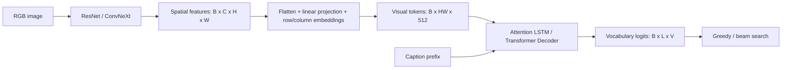

# Flickr30k 图像描述：CNN–Transformer 与 SCST

[English Version](README_EN.md)

这个项目是我在课程设计中完成的图像描述实验：输入一张图片，生成一句英文描述。我从 ResNet + Attention LSTM 开始，逐步尝试 Transformer Decoder、ConvNeXt 编码器、微调学习率和 SCST，希望弄清楚视觉特征、文本解码和训练目标分别会怎样影响生成结果。

这里记录模型实现、运行方式和保留下来的实验。最后我保留了 ConvNeXt-Base + Transformer + SCST 这一版；测试指标文件记录的 BLEU-4 为 **0.2342**、ROUGE-L 为 **0.4071**、CIDEr 为 **0.5468**，对应 beam 9、length penalty 0.9。

> 当前公开仓库缺少入口脚本依赖的 `src/data/`，也没有原始图片、`splits.json` 和 `vocab.json`。因此，这份仓库目前可用于阅读代码和检查实验记录，但还不能仅靠安装依赖就直接训练或推理。下文命令保留实际入口和参数，执行前需要恢复与实验匹配的数据模块、划分和词表；这次文档整理没有补写这些代码。

## 模型与代码流程

图像描述是条件自回归生成。给定图像 $I$，逐词生成描述 $y$：

$$
p_\theta(y\mid I)=\prod_{t=1}^{T}p_\theta(y_t\mid y_{<t},I).
$$

我把模型整理成 `CNN Encoder → Feature Adapter → Decoder`，方便更换编码器和解码器。视觉骨干使用 torchvision 的 ImageNet 预训练模型；文本端是项目中的 LSTM / Transformer 解码器，没有接入现成图像描述模型或 LLM。



- **CNN** 保留空间特征图。ResNet50/101 输出通道数为 2048，ConvNeXt-Tiny 为 768，ConvNeXt-Base 为 1024。
- **Feature Adapter** 展平空间网格，用线性层投影到 512 维，再加入可学习的行、列位置编码。384 × 384 输入经这些 stride-32 骨干通常得到 12 × 12 网格，即 144 个视觉 token。
- **Attention LSTM** 在每个词步用 additive attention 聚合视觉 token，经过门控后与词嵌入一起送入 LSTMCell。
- **Transformer Decoder** 使用带因果掩码的 self-attention 读取文本前缀，用 cross-attention 读取视觉 token。M5 配置是 4 层、8 个注意力头、隐藏维度 512、FFN 维度 2048、dropout 0.1。

这里 $B$ 是 batch size，$C$ 是 CNN 通道数，$H,W$ 是特征图高宽，$L$ 是文本输入长度，$V$ 是词表大小。训练输入为 `captions[:, :-1]`，目标为 `captions[:, 1:]`，输出形状为 $B\times L\times V$。

实现入口见 [builders.py](src/models/builders.py)、[feature_adapter.py](src/models/feature_adapter.py)、[decoders.py](src/models/decoders.py) 和 [caption_model.py](src/models/caption_model.py)。

| 版本 | 编码器 | 解码器 | 这一步尝试的内容 |
| --- | --- | --- | --- |
| M0 | ResNet50 | LSTM | 用全局图像特征初始化隐状态的参考实现，未保存测试指标 |
| M1 | ResNet50 | Attention LSTM | 作为实验起点 |
| M2 | ResNet101 | Attention LSTM | 更换为更深的 ResNet |
| M3 | ResNet101 | Transformer | 更换文本解码器 |
| M4 | ConvNeXt-Tiny | Transformer | 更换视觉骨干，并尝试第二阶段学习率 |
| M5 | ConvNeXt-Base | Transformer | 更换为 Base 骨干，再做 SCST 微调 |

## 数据处理与实验设置

入口脚本预期的数据布局如下；这些文件需要在本地准备：

```text
Flickr30k/
├── captions.txt
├── Flickr30k_Images/
│   └── *.jpg
├── splits.json
└── vocab.json
```

[prepare_data.py](scripts/prepare_data.py) 先读取图像对应的 captions，过滤掉没有对应 JPG 的条目，再把排序后的图像名交给划分函数。词表只使用训练划分中的 captions 构建，避免把验证、测试文本用于词表统计。

[保存的 M5 配置](outputs/m5_convnext_base_resize384_lra/config.json) 可以确认以下参数：

| 参数 | 值 |
| --- | --- |
| 训练 / 验证比例 | 0.8 / 0.1，其余为测试集 |
| 随机种子 | 42 |
| 词频阈值 / 词表上限 | 3 / 12,000 |
| 最大序列长度 | 32 |
| 输入尺寸 | 384 × 384 |
| CE batch size | 32 |

[原有优化记录](OPTIMIZATION_LOG.md) 记载主实验划分为 25,426 / 3,178 / 3,179 张图，并在最终主线恢复了 8:1:1 划分。旧项目说明记载词表大小为 9,469，使用小写正则分词、特殊 token `<pad>`、`<bos>`、`<eos>`、`<unk>`，以及训练时翻转、颜色扰动和 ImageNet 归一化。**这些是已有文档记录**：当前仓库缺少数据模块和实际划分、词表，不能从公开代码重新核验分词、增强细节或重新统计样本数量。

优化记录还记载最终使用直接 resize，并尝试过 resize-pad 和 9:0.5:0.5 划分。这些状态没有完整保存在配置中，不能只看目录名称或当前默认值就重建当时全部预处理。

## 训练过程

### 交叉熵训练

我先冻结 CNN，训练适配器和解码器，再解冻 CNN 最后一个 stage 做微调。保存的 M5 运行配置为：

| 设置 | M5 CE |
| --- | --- |
| 第一 / 第二阶段 | 12 / 8 epochs |
| 第一阶段适配器、解码器学习率 | `3e-4` |
| 第二阶段适配器、解码器学习率 | `5e-5` |
| 第二阶段 CNN 学习率 | `1e-5` |
| 优化器 / weight decay | AdamW / `1e-4` |
| 每阶段 warmup | 1,000 steps，之后 cosine decay |
| label smoothing / 梯度裁剪 | 0.1 / 1.0 |
| 混合精度 | CUDA 可用时启用 AMP |

普通 token 交叉熵可以写为：

$$
L_{\mathrm{CE}}=-\frac{1}{N}\sum_{(b,t)\in\mathcal{M}}
\log p_\theta(y_{b,t}^{*}\mid y_{b,<t}^{*},I_b).
$$

$\mathcal{M}$ 是非 padding 目标位置集合，$N=|\mathcal{M}|$。实际 [caption_loss](src/engine/train_loop.py) 使用 `F.cross_entropy`，忽略 padding，并开启 0.1 label smoothing；上式表示未平滑的基本形式。

[train.py](scripts/train.py) 按最低 validation CE 保存 `best.pt`。M5 的 [训练日志](outputs/m5_convnext_base_resize384_lra/train_log.csv) 中，最低 validation loss 为 **3.668023，epoch 19**。早期 M1–M4 的轮数和学习率并不都相同，不能把这组 M5 参数套用到所有历史实验。

### SCST 微调

CE 优化每一步的目标词，我随后尝试用生成句子的 reward 做微调。当前入口使用 `FlickrSCSTDataset`；优化记录描述它按图像组织，每张图配一条辅助 CE 参考，而不是按每条 caption 重复执行序列级更新。这个 dataset 的实现仍属于上述缺失的数据模块。

每张图片分别生成 greedy baseline 和随机采样描述。对于保留的 safe 配置：

$$
A_i=R(y_i^{\mathrm{sample}})-R(y_i^{\mathrm{greedy}}),
\qquad
\widehat{A}_i=\operatorname{NormalizeBatch}(A_i).
$$

$$
L_{\mathrm{SCST}}=-\frac{1}{B}\sum_{i=1}^{B}
\operatorname{stopgrad}(\widehat{A}_i)
\frac{1}{T_i}\sum_{t=1}^{T_i}\log q_\theta
(y_{i,t}^{\mathrm{sample}}\mid y_{i,<t}^{\mathrm{sample}},I_i).
$$

$$
L=L_{\mathrm{SCST}}+0.2L_{\mathrm{CE}}.
$$

$T_i$ 是有效采样步数；$q_\theta$ 是经过 temperature 和 Top-k 处理后的采样分布。代码对 batch advantage 做标准化，近零方差时仅减均值，单样本时保持原值；梯度通过采样词的 log probability 回传。

[SCST 配置](outputs/m5_convnext_base_resize384_lra_scst_cider_safe/scst_config.json) 记录：冻结 CNN，学习率 `2e-6`，3 epochs，batch size 16，temperature 0.8，Top-k 50，每张图采样 1 条描述，CE 权重 0.2，开启 advantage 与序列长度归一化。checkpoint 按 validation CIDEr 选择。

这里要区分两个 CIDEr：训练 reward 来自 [reward.py](src/metrics/reward.py) 的 CIDEr-style TF-IDF n-gram 相似度；正式验证、测试分数来自 [pycocoevalcap 封装](src/metrics/official_caption_metrics.py)。它们不是同一套计算实现。

## 解码与评价

`beam_size=1` 使用 greedy；更大的值使用 beam search。beam 中的候选按照下面的分数排序：

$$
s(y)=\frac{\sum_t\log p_\theta(y_t\mid y_{<t},I)}{|y|^\alpha}.
$$

$\alpha$ 是 length penalty；当前实现的 `len(seq)` 包含起始 token。Top-k 用于 SCST 随机采样，不是最终 beam 解码的参数。

正式结果使用 BLEU-1/2/3/4、METEOR、ROUGE-L 和 CIDEr；`lightweight` 后端仅作为另一条评估路径，不能与 `_official.json` 混用。仓库保留了 M4 的验证集解码搜索 CSV；最终 beam 9 / LP 0.9 的选择过程记载在优化记录中，但没有对应的完整搜索 CSV。

## 保存的实验结果

下表直接对应各行链接的 `_official.json`，保留四位小数，完整精度见原文件。模型、训练设置和部分解码参数同时发生过变化，因此这是实验路线记录，不是全部严格控制单变量的消融。

| Model | Beam / LP | BLEU-1 | BLEU-2 | BLEU-3 | BLEU-4 | METEOR | ROUGE-L | CIDEr |
| --- | --- | ---: | ---: | ---: | ---: | ---: | ---: | ---: |
| [M1](outputs/m1_resnet50_attlstm/metrics_test_beam5_lp0p7_official.json) | 5 / 0.7 | 0.6205 | 0.4304 | 0.2984 | 0.2049 | 0.2027 | 0.3860 | 0.4664 |
| [M2](outputs/m2_resnet101_attlstm/metrics_test_beam5_lp0p7_official.json) | 5 / 0.7 | 0.6245 | 0.4362 | 0.3042 | 0.2104 | 0.2017 | 0.3864 | 0.4670 |
| [M3](outputs/m3_resnet101_transformer/metrics_test_beam5_lp0p7_official.json) | 5 / 0.7 | 0.6210 | 0.4304 | 0.2979 | 0.2049 | 0.2038 | 0.3879 | 0.4690 |
| [M4](outputs/m4_convnext_tiny_transformer/metrics_test_beam5_lp0p7_official.json) | 5 / 0.7 | 0.6290 | 0.4429 | 0.3115 | 0.2182 | 0.2098 | 0.3941 | 0.4940 |
| [M4-lrB](outputs/m4_convnext_tiny_transformer_lrB/metrics_test_beam7_lp0p7_official.json) | 7 / 0.7 | 0.6320 | 0.4474 | 0.3164 | 0.2228 | 0.2103 | 0.3958 | 0.5010 |
| [M5 CE](outputs/m5_convnext_base_resize384_lra/metrics_test_beam7_lp0p8_official.json) | 7 / 0.8 | 0.6444 | 0.4600 | 0.3270 | 0.2304 | 0.2179 | 0.4055 | 0.5355 |
| [M5 SCST](outputs/m5_convnext_base_resize384_lra_scst_cider_safe/metrics_test_beam7_lp0p8_official.json) | 7 / 0.8 | 0.6477 | 0.4639 | 0.3306 | 0.2342 | 0.2161 | 0.4056 | 0.5439 |
| [M5 SCST](outputs/m5_convnext_base_resize384_lra_scst_cider_safe/metrics_test_beam9_lp0p9_official.json) | 9 / 0.9 | 0.6474 | 0.4640 | 0.3307 | 0.2342 | 0.2174 | 0.4071 | 0.5468 |


我从这些记录中观察到：

- M1 → M2 的 CIDEr 从 0.4664 到 0.4670；M3 为 0.4690。单独加深 ResNet 或更换解码器，在这组实验中的变化不大。
- M5 CE 与 SCST 都使用 beam 7 / LP 0.8 时，CIDEr 从 **0.5355 到 0.5439**。最终 beam 9 / LP 0.9 的结果为 **0.5468**，所以最终相对 CE 的差值同时包含微调和解码设置的变化。
- 最终 METEOR 从 CE 的 0.2179 变为 0.2174，不能概括为所有指标都提高。
- 第一版 SCST 的 [日志](outputs/m5_convnext_base_resize384_lra_scst_cider/scst_log.csv) 中，validation CIDEr 在第 1 轮为 0.033708，第 5 轮为 0.017497。safe 版的 [日志](outputs/m5_convnext_base_resize384_lra_scst_cider_safe/scst_log.csv) 从第 0 轮的 0.535287 到第 3 轮的 0.543718，中间第 2 轮有回落。它比失败版本稳定，但不是逐轮单调上升。
- 优化记录把第一版失败与重复的图像级更新联系起来，并记载了降低学习率、增加 CE 权重等调整。多项设置一起改变，我没有用单独的消融证明其中某一项就是全部原因。
- M5 resize-pad 的 CIDEr 为 [0.5313](outputs/m5_convnext_base_resizepad384_lra/metrics_test_beam7_lp0p8_official.json)，direct-resize 主线为 0.5355。临时 split90 的 [0.5368](outputs/m5_convnext_base_resize384_lra_split90_full/metrics_test_beam7_lp0p8_official.json) 使用不同划分，不作为同测试集上的提升。

### 生成描述中的问题

下面摘自已有项目说明中的样例记录。原始图片和完整预测 CSV 没有提交，因此这里保留的是当时记录的描述与观察，没有重新生成或重新看图判定。

| 图片名 | 记录的生成描述 | 记录中的问题 |
| --- | --- | --- |
| `4717895395.jpg` | `two children are playing in the dirt` | 保留主体和场景，遗漏铲子及挖土细节 |
| `7420874336.jpg` | `three men are standing on the deck of a ship` | 参考描述为两名男子，人数写成三名 |
| `5968404576.jpg` | `two men are competing in a martial arts tournament` | 参考描述为两名女子，性别词错误 |
| `5869269064.jpg` | `a woman in a blue leotard is jumping on a trampoline` | 记录指出模型补出了 trampoline |
| `4234228276.jpg` | `two men are sitting at a table drinking beer` | 遗漏指向动作，把背景啤酒瓶写成饮酒动作 |

这些例子让我更关注人数、动作和对象关系，而不只看句子是否通顺。粗空间网格、图像级监督和语言共现偏好可能影响这些错误，但目前只是解释假设，没有独立的因果实验。

## 如何运行

**先恢复缺失的 `src/data/`，并准备与 checkpoint 匹配的词表和数据划分。重新生成一个同样大小的词表不代表 token ID 一定相同。** 从仓库根目录运行下面的命令，优先复用现有 Python 环境；依赖见 [requirements.txt](requirements.txt)，official METEOR 还需要 `java` 在 PATH 中。

```powershell
python -m pip install -r requirements.txt
java -version
```

权重通过 Git LFS 管理。根目录保留 ResNet50/101、ConvNeXt-Tiny/Base 预训练权重指针；`outputs/` 保留 M5 CE 与 safe SCST 的 `best.pt` 指针。读取指针不能确认 LFS 对象下载是否成功。已有 Git LFS 时，可按需获取：

```powershell
git lfs pull --include="convnext_base-6075fbad.pth,outputs/m5_convnext_base_resize384_lra/best.pt,outputs/m5_convnext_base_resize384_lra_scst_cider_safe/best.pt"
```

准备数据（只在新数据副本中执行，避免覆盖已有划分和词表）：

```powershell
python scripts/prepare_data.py --data-root Flickr30k --train-ratio 0.8 --val-ratio 0.1 --seed 42
```

训练 M5 CE。示例使用新的 run name，以免覆盖已保存的实验：

```powershell
python scripts/train.py --model m5 --data-root Flickr30k --image-size 384 --batch-size 32 --epochs-stage1 12 --epochs-stage2 8 --lr-decoder 3e-4 --lr-encoder 3e-5 --lr-decoder-stage2 5e-5 --lr-encoder-stage2 1e-5 --encoder-weights convnext_base-6075fbad.pth --run-name m5_ce_reproduce
```

从归档的 M5 CE checkpoint 运行 safe SCST 参数；若使用自己的 CE 结果，替换 `--checkpoint`：

```powershell
python scripts/train_scst.py --checkpoint outputs/m5_convnext_base_resize384_lra/best.pt --data-root Flickr30k --run-name m5_scst_reproduce --epochs 3 --batch-size 16 --lr-decoder 2e-6 --lr-encoder 0 --ce-weight 0.2 --temperature 0.8 --top-k 50 --normalize-advantage --beam-size 7 --length-penalty 0.8 --metrics-backend official
```

评价保留的最终 checkpoint，并把新结果写入独立目录：

```powershell
python scripts/evaluate.py --checkpoint outputs/m5_convnext_base_resize384_lra_scst_cider_safe/best.pt --data-root Flickr30k --split test --beam-size 9 --length-penalty 0.9 --metrics-backend official --output outputs/evaluation_reproduce
```

该脚本写出指标 JSON 和逐图预测 CSV。样例导出入口是 [predict_samples.py](scripts/predict_samples.py)，验证集解码参数搜索入口是 [search_decode_params.py](scripts/search_decode_params.py)；先查看参数并指定新的输出位置。

## 仓库目录

```text
.
├── src/
│   ├── config.py
│   ├── models/                # CNN、适配器、解码器与生成
│   ├── engine/                # CE / SCST 训练循环与调度器
│   ├── metrics/               # official / lightweight 指标与 reward
│   └── utils/                # checkpoint、CSV 日志和随机种子
├── scripts/                   # 数据准备、训练、评估、解码搜索和绘图入口
├── outputs/                   # 配置、日志、指标、曲线及两个 LFS checkpoint
├── OPTIMIZATION_LOG.md         # 历史尝试和决策，含早期计划
├── PROJECT_SUMMARY.md          # 既有技术整理，部分内容依赖本地材料
├── requirements.txt
├── README.md
└── README_EN.md
```

`src/data/` 是入口依赖但未提交的目录，不在上面的已提交目录树中。原始数据、划分、词表和完整预测 CSV 同样缺失。代码固定主要随机源，但启用了 `cudnn.benchmark=True`，不能保证位级复现。这里没有补写 M0 或 M4-lrA 缺失的测试指标，也没有根据单次实验推断统计显著性。

## 参考

- [Flickr30k Entities](https://arxiv.org/abs/1505.04870)
- [Show and Tell](https://arxiv.org/abs/1411.4555)
- [Show, Attend and Tell](https://arxiv.org/abs/1502.03044)
- [Attention Is All You Need](https://arxiv.org/abs/1706.03762)
- [A ConvNet for the 2020s](https://arxiv.org/abs/2201.03545)
- [Self-Critical Sequence Training for Image Captioning](https://arxiv.org/abs/1612.00563)
- [CIDEr](https://arxiv.org/abs/1411.5726)
