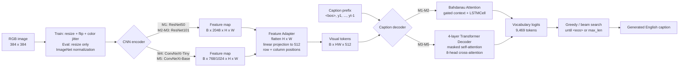
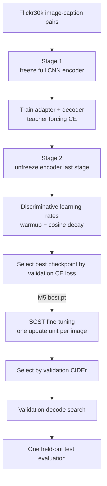

# Flickr30k Image Captioning with CNN-Transformer and SCST

An end-to-end image captioning project built on Flickr30k. It compares ResNet/ConvNeXt visual encoders, Attention-LSTM/Transformer decoders, beam-search decoding, and CIDEr-oriented Self-Critical Sequence Training (SCST).

本项目不调用 BLIP、LLM 或现成图像描述模型。ImageNet 预训练权重只用于初始化视觉编码器；Feature Adapter、Attention-LSTM、Transformer Decoder 和词表输出层均在 Flickr30k 上训练。

## Overview

The system formulates image captioning as conditional autoregressive generation:

\[
p_\theta(y\mid I)=\prod_{t=1}^{T}p_\theta(y_t\mid y_{<t}, I).
\]

Given an RGB image, a CNN produces a spatial feature map. A shared adapter converts backbone-specific channels into 512-dimensional visual tokens with learned row/column position embeddings. The decoder then predicts the next token from the image tokens and the caption prefix.

The final model is **ConvNeXt-Base + Transformer Decoder + SCST**. The checked official test artifact reports **BLEU-4 0.2342**, **ROUGE-L 0.4071**, and **CIDEr 0.5468** with beam size 9 and length penalty 0.9.

## Highlights

- Unified `Encoder -> Feature Adapter -> Decoder` interface for six model specifications, M0-M5.
- Controlled comparisons across ResNet50, ResNet101, ConvNeXt-Tiny, ConvNeXt-Base, Attention LSTM, and Transformer Decoder.
- Two-stage transfer learning: frozen ImageNet encoder, followed by low-learning-rate fine-tuning of its last stage.
- Autoregressive greedy decoding and beam search with length penalty; validation-set search over decoding hyperparameters.
- Image-level SCST with a greedy self-critical baseline, CIDEr-style reward, CE anchoring, Top-k sampling, advantage normalization, and length-normalized sequence log-probability.
- Two evaluation paths: `pycocoevalcap` for report numbers and a lightweight in-repo implementation for debugging.

## Architecture



At 384 x 384 input resolution, the stride-32 backbones normally produce a 12 x 12 grid, i.e. 144 visual tokens. The adapter keeps the decoder interface fixed while the backbone output channel count changes.

## Dataset

The project expects the Kaggle-style Flickr30k layout:

```text
Flickr30k/
├── captions.txt
└── Flickr30k_Images/
    ├── 1000092795.jpg
    └── ...
```

Run:

```bash
python scripts/prepare_data.py --data-root Flickr30k
```

The script:

1. reads `captions.txt` with `image` and `caption` columns;
2. filters annotations to existing `.jpg` files;
3. shuffles sorted image names with seed 42 and splits **by image**, preventing five captions from the same image leaking across splits;
4. writes `splits.json`;
5. builds `vocab.json` from training captions only.

The final report records the following main protocol:

| Item | Value |
| --- | --- |
| Images | 31,783 |
| Train / validation / test | 25,426 / 3,178 / 3,179 images |
| Split ratio and seed | 8:1:1, seed 42 |
| Captions per image | usually 5 |
| Tokenizer | lowercase regex `[a-z0-9]+(?:'[a-z]+)?` |
| Vocabulary | min frequency 3, cap 12,000, observed size 9,469 |
| Special tokens | `<pad>`, `<bos>`, `<eos>`, `<unk>` |
| Maximum sequence length | 32 tokens, preserving `<eos>` after truncation |

The raw dataset, generated split, and vocabulary are intentionally excluded from Git. Re-run `prepare_data.py` with the same data and seed to reconstruct them.

## Model Variants

All numbers below are test-set results from the **official `pycocoevalcap` backend**. M1-M3 used beam 5 / length penalty 0.7, M4 used the recorded beam-5 result, M4-lrB and M5 used their recorded beam-7 settings, and the final result used beam 9 / length penalty 0.9. These are therefore an experiment-route summary, not a perfectly single-variable benchmark.

| Model | Encoder | Decoder | Training strategy | BLEU-4 | CIDEr | Main change |
| --- | --- | --- | --- | ---: | ---: | --- |
| M1 | ResNet50 | Attention LSTM | CE, two-stage | 0.2049 | 0.4664 | Formal baseline |
| M2 | ResNet101 | Attention LSTM | CE, two-stage | 0.2104 | 0.4670 | Deeper ResNet; little gain |
| M3 | ResNet101 | Transformer | CE, two-stage | 0.2049 | 0.4690 | Decoder replacement; limited gain |
| M4 | ConvNeXt-Tiny | Transformer | CE, two-stage | 0.2182 | 0.4940 | Modern CNN visual encoder |
| M4-lrB | ConvNeXt-Tiny | Transformer | CE, lower stage-2 LR | 0.2228 | 0.5010 | Fine-tuning-rate ablation |
| M5 | ConvNeXt-Base | Transformer | CE, two-stage | 0.2304 | 0.5355 | Strong CE baseline |
| M5+SCST | ConvNeXt-Base | Transformer | CIDEr-style SCST + 0.2 CE | **0.2342** | **0.5468** | Sequence-level fine-tuning |

M0 (`ResNet50 + vanilla LSTM`) remains implemented as a reference architecture, but no trustworthy M0 evaluation artifact was found, so no score is reported.

## Training Pipeline



For teacher-forced training, inputs are `caption[:, :-1]` and targets are `caption[:, 1:]`. Padding positions are ignored:

\[
\mathcal{L}_{CE}=-\sum_t \log p_\theta(y_t^*\mid y_{<t}^*,I),
\]

implemented as cross-entropy with label smoothing 0.1. The optimizer is AdamW with weight decay `1e-4`; encoder and non-encoder parameters use separate learning rates. Each stage constructs its own linear-warmup/cosine-decay schedule with 1,000 warmup steps. Training also uses gradient clipping at 1.0 and CUDA AMP when available.

## SCST

SCST starts from the best M5 cross-entropy checkpoint. For each image, the model generates:

- a greedy caption used as the self-critical baseline;
- a sampled caption with recorded token log-probabilities.

The implementation computes:

\[
A = R(y^{sample}) - R(y^{greedy}),
\]

\[
\mathcal{L}_{SCST}=-A\,\frac{1}{T}\sum_{t=1}^{T}\log p_\theta(y_t^{sample}\mid y_{<t}^{sample},I),
\]

\[
\mathcal{L}=\mathcal{L}_{SCST}+0.2\mathcal{L}_{CE}.
\]

The safe run freezes the CNN, trains the adapter and Transformer decoder for 3 epochs with learning rate `2e-6`, samples at temperature 0.8 with Top-k=50, normalizes the batch advantage, and length-normalizes sequence log-probability.

Important distinction: the **training reward** in `src/metrics/reward.py` is a fast in-repo CIDEr-style TF-IDF n-gram score. The **reported validation/test CIDEr** is computed separately by `pycocoevalcap`.

## Evaluation

Generation is autoregressive. `beam_size=1` selects greedy decoding; larger values use beam search and rank prefixes by:

\[
score(y)=\frac{\log p_\theta(y\mid I)}{|y|^\alpha}.
\]

Beam search was genuinely used: the repository contains validation decode-search results and test metric files for beam sizes 5, 7, and 9. Top-k was used only for stochastic SCST sampling, not for the final deterministic caption generation.

Formal metrics:

- **BLEU-1/2/3/4:** clipped n-gram precision with brevity penalty.
- **METEOR:** alignment-oriented score with stronger recall sensitivity.
- **ROUGE-L:** longest-common-subsequence overlap.
- **CIDEr:** TF-IDF-weighted n-gram consensus across multiple human references.

## Results

| Model | BLEU-1 | BLEU-2 | BLEU-3 | BLEU-4 | METEOR | ROUGE-L | CIDEr |
| --- | ---: | ---: | ---: | ---: | ---: | ---: | ---: |
| M1 | 0.6205 | 0.4304 | 0.2984 | 0.2049 | 0.2027 | 0.3860 | 0.4664 |
| M2 | 0.6245 | 0.4362 | 0.3042 | 0.2104 | 0.2017 | 0.3864 | 0.4670 |
| M3 | 0.6210 | 0.4304 | 0.2979 | 0.2049 | 0.2038 | 0.3879 | 0.4690 |
| M4 | 0.6290 | 0.4429 | 0.3115 | 0.2182 | 0.2098 | 0.3941 | 0.4940 |
| M4-lrB | 0.6320 | 0.4474 | 0.3164 | 0.2228 | 0.2103 | 0.3958 | 0.5010 |
| M5 | 0.6444 | 0.4600 | 0.3270 | 0.2304 | **0.2179** | 0.4055 | 0.5355 |
| M5+SCST | **0.6474** | **0.4640** | **0.3307** | **0.2342** | 0.2174 | **0.4071** | **0.5468** |

SCST improves CIDEr by **+0.0113 absolute** over M5 and also raises BLEU-4 and ROUGE-L. METEOR decreases slightly from 0.2179 to 0.2174, so the evidence supports a CIDEr-oriented improvement rather than a universal gain on every metric.


## Caption Examples

These examples come from the final M5+SCST checkpoint with beam 9 and length penalty 0.9.

| Image | Generated caption | Observation |
| --- | --- | --- |
| `4717895395.jpg` | `two children are playing in the dirt` | Correct main subjects and scene; omits shovels/digging. |
| `4589055346.jpg` | `a woman in a red shirt and a red hat is smiling` | Correct person, colors, and expression; misses soccer/Swiss details. |
| `7420874336.jpg` | `three men are standing on the deck of a ship` | Correct ship scene, wrong count: references say two men. |
| `5968404576.jpg` | `two men are competing in a martial arts tournament` | Correct event, wrong gender: references say two women. |
| `5869269064.jpg` | `a woman in a blue leotard is jumping on a trampoline` | Hallucinates a trampoline and misreads the gymnastics/dance pose. |
| `4234228276.jpg` | `two men are sitting at a table drinking beer` | Uses table/beer context but misses pointing; “drinking” is unsupported. |

## Error Analysis

Observed failure modes include wrong person counts, gender substitution, coarse or incorrect actions, simplified object relations, hallucinated objects/actions, and safe template-like captions. Likely contributing factors are the stride-32 CNN feature grid, image-level caption supervision without region grounding, limited Flickr30k scale, language-prior bias, teacher-forcing exposure bias, and beam search/CIDEr objectives that reward common reference-like phrasing. These are hypotheses from the evidence, not separately measured causal claims.

See [PROJECT_SUMMARY.md](PROJECT_SUMMARY.md) for the full evidence-backed analysis, failed experiments, resume bullets, and interview questions.

## Installation

```bash
git lfs install
python -m venv .venv
# Linux/macOS: source .venv/bin/activate
# Windows PowerShell: .\.venv\Scripts\Activate.ps1
python -m pip install --upgrade pip
python -m pip install -r requirements.txt
```

Install a CUDA-compatible PyTorch build for GPU training. Official METEOR evaluation also requires Java on `PATH`.

Core dependencies actually used by the captioning pipeline are Python, PyTorch, torchvision, Pillow, NumPy, tqdm, Matplotlib, and pycocoevalcap. OpenCV, pandas, timm, Hugging Face Transformers, TensorBoard, and NLTK are not used by the model pipeline.

## Usage

Prepare data:

```bash
python scripts/prepare_data.py --data-root Flickr30k
```

Train the M5 cross-entropy baseline:

```bash
python scripts/train.py \
  --model m5 \
  --data-root Flickr30k \
  --image-size 384 \
  --batch-size 32 \
  --epochs-stage1 12 \
  --epochs-stage2 8 \
  --lr-decoder 3e-4 \
  --lr-encoder 3e-5 \
  --lr-decoder-stage2 5e-5 \
  --lr-encoder-stage2 1e-5 \
  --encoder-weights convnext_base-6075fbad.pth \
  --run-name m5_convnext_base_resize384_lra
```

Run the stable SCST fine-tuning recipe:

```bash
python scripts/train_scst.py \
  --checkpoint outputs/m5_convnext_base_resize384_lra/best.pt \
  --data-root Flickr30k \
  --run-name m5_convnext_base_resize384_lra_scst_cider_safe \
  --epochs 3 \
  --batch-size 16 \
  --lr-decoder 2e-6 \
  --lr-encoder 0 \
  --ce-weight 0.2 \
  --temperature 0.8 \
  --top-k 50 \
  --normalize-advantage \
  --beam-size 7 \
  --length-penalty 0.8 \
  --metrics-backend official
```

Evaluate the final checkpoint:

```bash
python scripts/evaluate.py \
  --checkpoint outputs/m5_convnext_base_resize384_lra_scst_cider_safe/best.pt \
  --data-root Flickr30k \
  --split test \
  --beam-size 9 \
  --length-penalty 0.9 \
  --metrics-backend official
```

Export qualitative samples:

```bash
python scripts/predict_samples.py \
  --checkpoint outputs/m5_convnext_base_resize384_lra_scst_cider_safe/best.pt \
  --data-root Flickr30k \
  --split test \
  --num-samples 10 \
  --beam-size 9 \
  --length-penalty 0.9
```

## Checkpoints and Git LFS

The local workspace contains 35 checkpoint/weight files totaling about 15.02 GiB. To keep the public repository usable, only the following artifacts are selected for the initial LFS push:

| Artifact | Size | Purpose |
| --- | ---: | --- |
| `resnet50-11ad3fa6.pth` | 97.79 MiB | M1/M0 ImageNet initialization |
| `resnet101-cd907fc2.pth` | 170.53 MiB | M2/M3 ImageNet initialization |
| `convnext_tiny-983f1562.pth` | 109.12 MiB | M4 ImageNet initialization |
| `convnext_base-6075fbad.pth` | 338.06 MiB | M5 ImageNet initialization |
| `outputs/m5_convnext_base_resize384_lra/best.pt` | 833.01 MiB | SCST starting checkpoint |
| `outputs/m5_convnext_base_resize384_lra_scst_cider_safe/best.pt` | 435.99 MiB | Final inference checkpoint |

All exceed or approach GitHub's recommended normal-Git size, and files above 100 MiB cannot be pushed through ordinary Git. `.gitattributes` therefore routes `.pt` and `.pth` files through Git LFS. The remaining local checkpoints are not deleted; `.gitignore` excludes them from the initial public push. See [GitHub's large-file documentation](https://docs.github.com/en/repositories/working-with-files/managing-large-files/about-large-files-on-github).

To clone without downloading LFS objects immediately:

```bash
GIT_LFS_SKIP_SMUDGE=1 git clone <repo-url>
git lfs pull --include="outputs/m5_convnext_base_resize384_lra_scst_cider_safe/best.pt"
```

## Project Structure

```text
.
├── src/
│   ├── data/                 # splits, vocabulary, datasets, transforms
│   ├── models/               # CNN encoders, adapter, decoders, unified model
│   ├── engine/               # CE and SCST training loops, scheduler
│   ├── metrics/              # official/lightweight metrics and SCST reward
│   └── utils/                # checkpointing, logging, reproducibility helpers
├── scripts/
│   ├── prepare_data.py
│   ├── train.py
│   ├── train_scst.py
│   ├── evaluate.py
│   ├── search_decode_params.py
│   └── predict_samples.py
├── outputs/                  # compact configs, logs, metrics, and selected LFS checkpoints
├── PROJECT_SUMMARY.md        # job-oriented technical deep dive and interview guide
├── requirements.txt
├── .gitattributes
└── .gitignore
```

The local `code/` directory is an older duplicate snapshot and is intentionally excluded from Git. Course PDFs/DOCX files and report-building utilities are also excluded because they contain submission-specific material and personal information.

## Reproducibility Notes

- The split seed is fixed at 42, but `torch.backends.cudnn.benchmark=True` means training is not guaranteed bitwise deterministic.
- The main result uses `pycocoevalcap`; files without `_official` in their names may come from the lightweight backend and must not be mixed into the main table.
- Resize-pad and the temporary 9:0.5:0.5 split were controlled by dataset-file/code state rather than fully captured configuration fields. They are reported only as secondary ablations.
- The final beam-9 metric JSON and ten sample captions are present; the full beam-9 prediction CSV was not found.

## Acknowledgements / References

- [Flickr30k Entities](https://arxiv.org/abs/1505.04870)
- [Show and Tell](https://arxiv.org/abs/1411.4555)
- [Show, Attend and Tell](https://arxiv.org/abs/1502.03044)
- [Attention Is All You Need](https://arxiv.org/abs/1706.03762)
- [A ConvNet for the 2020s](https://arxiv.org/abs/2201.03545)
- [Self-Critical Sequence Training for Image Captioning](https://arxiv.org/abs/1612.00563)
- [CIDEr](https://arxiv.org/abs/1411.5726)

