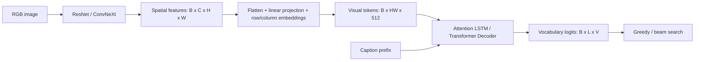
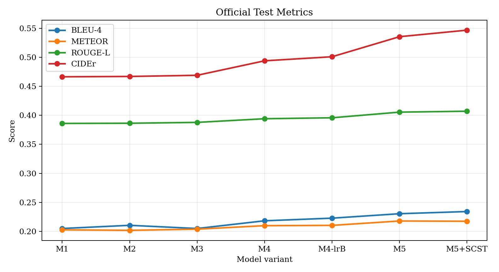

# Flickr30k Image Captioning with CNN–Transformer and SCST

[中文版](README.md)

I built this project for a course assignment to explore how a CNN can provide visual features for an autoregressive caption decoder. I started with ResNet and Attention LSTM, then tried a Transformer decoder, ConvNeXt encoders, different fine-tuning rates, and Self-Critical Sequence Training (SCST).

This README records the implementation, the experiments I kept, and how to run the entry points. My final saved version uses ConvNeXt-Base, a Transformer decoder, and SCST. Its test artifact reports **BLEU-4 0.2342**, **ROUGE-L 0.4071**, and **CIDEr 0.5468**, with beam size 9 and length penalty 0.9.

> The public repository currently lacks `src/data/`, which the entry points import. The raw images, `splits.json`, and `vocab.json` are also absent. The code and saved results can be inspected, but installing dependencies alone is not enough to train or run inference. The commands below require restoring the matching data module, split, and vocabulary first; this documentation update does not reconstruct that code.

## Model and code flow

Captioning is conditional autoregressive generation. Given an image $I$, the decoder generates a caption $y$ one token at a time:

$$
p_\theta(y\mid I)=\prod_{t=1}^{T}p_\theta(y_t\mid y_{<t},I).
$$

I organized the model as `CNN Encoder → Feature Adapter → Decoder` so I could swap encoders and decoders. The visual backbones use torchvision ImageNet pretraining. The text side uses the project's LSTM or Transformer decoder, without a pretrained captioning model or LLM.



- **CNN:** keeps a spatial feature map. ResNet50/101 have 2,048 output channels, ConvNeXt-Tiny has 768, and ConvNeXt-Base has 1,024.
- **Feature Adapter:** flattens the grid, projects each location to 512 dimensions, and adds learned row and column embeddings. A 384 × 384 input normally produces a 12 × 12 grid with these stride-32 backbones: 144 visual tokens.
- **Attention LSTM:** uses additive attention at each word step, gates the visual context, and feeds it to an LSTMCell with the word embedding.
- **Transformer Decoder:** uses causal self-attention over the caption prefix and cross-attention over visual tokens. The M5 configuration has 4 layers, 8 heads, model width 512, FFN width 2,048, and dropout 0.1.

$B$ is the batch size, $C$ the CNN channel count, $H,W$ the feature-grid dimensions, $L$ the text input length, and $V$ the vocabulary size. Training feeds `captions[:, :-1]` and predicts `captions[:, 1:]`, producing logits of shape $B\times L\times V$.

The relevant files are [builders.py](src/models/builders.py), [feature_adapter.py](src/models/feature_adapter.py), [decoders.py](src/models/decoders.py), and [caption_model.py](src/models/caption_model.py).

| Version | Encoder | Decoder | What I tried |
| --- | --- | --- | --- |
| M0 | ResNet50 | LSTM | Reference implementation initialized from pooled image features; no saved test metrics |
| M1 | ResNet50 | Attention LSTM | Starting point for the experiments |
| M2 | ResNet101 | Attention LSTM | A deeper ResNet |
| M3 | ResNet101 | Transformer | A different text decoder |
| M4 | ConvNeXt-Tiny | Transformer | A different visual backbone and stage-2 learning rates |
| M5 | ConvNeXt-Base | Transformer | The Base backbone, followed by SCST |

## Data and experiment settings

The entry points expect the following local files:

```text
Flickr30k/
├── captions.txt
├── Flickr30k_Images/
│   └── *.jpg
├── splits.json
└── vocab.json
```

[prepare_data.py](scripts/prepare_data.py) loads captions by image, removes entries without a matching JPG, and passes sorted image names to the split function. Only captions from the training split are passed to vocabulary construction.

The [saved M5 configuration](outputs/m5_convnext_base_resize384_lra/config.json) records:

| Setting | Value |
| --- | --- |
| Training / validation ratios | 0.8 / 0.1; the remainder is the test split |
| Seed | 42 |
| Minimum word frequency / vocabulary cap | 3 / 12,000 |
| Maximum sequence length | 32 |
| Input size | 384 × 384 |
| CE batch size | 32 |

The [optimization log](OPTIMIZATION_LOG.md) records 25,426 / 3,178 / 3,179 images and a return to the 8:1:1 split for the final experiments. Earlier project notes record a 9,469-token vocabulary, lowercase regex tokenization, `<pad>`/`<bos>`/`<eos>`/`<unk>` tokens, and training-time flips, color jitter, and ImageNet normalization. **These details survive as documentation records.** Without the data module, split, and vocabulary, the public tree cannot independently verify tokenization or augmentation, or recount the images.

The log also records direct resizing for the final run and earlier resize-pad and 9:0.5:0.5 split experiments. Those changes were not fully captured in configuration fields; directory names and current defaults do not reconstruct all historical preprocessing.

## Training

### Cross-entropy training

I first froze the CNN and trained the adapter and decoder, then unfroze the CNN's last stage. The saved M5 run uses:

| Setting | M5 CE |
| --- | --- |
| Stage 1 / stage 2 | 12 / 8 epochs |
| Stage-1 adapter and decoder learning rate | `3e-4` |
| Stage-2 adapter and decoder learning rate | `5e-5` |
| Stage-2 CNN learning rate | `1e-5` |
| Optimizer / weight decay | AdamW / `1e-4` |
| Warmup per stage | 1,000 steps, followed by cosine decay |
| Label smoothing / gradient clipping | 0.1 / 1.0 |
| Mixed precision | AMP when running on CUDA |

The basic token cross-entropy objective is:

$$
L_{\mathrm{CE}}=-\frac{1}{N}\sum_{(b,t)\in\mathcal{M}}
\log p_\theta(y_{b,t}^{*}\mid y_{b,<t}^{*},I_b).
$$

$\mathcal{M}$ contains non-padding target positions and $N=|\mathcal{M}|$. The actual [caption_loss](src/engine/train_loop.py) uses `F.cross_entropy` with padding ignored and label smoothing 0.1; the equation shows the unsmoothed form.

[train.py](scripts/train.py) saves `best.pt` by minimum validation CE. The M5 [training log](outputs/m5_convnext_base_resize384_lra/train_log.csv) reaches its minimum validation loss of **3.668023 at epoch 19**. Earlier M1–M4 runs used different epoch counts and learning rates, so these M5 settings should not be applied retrospectively to all runs.

### SCST fine-tuning

After token-level CE training, I tried optimizing rewards for generated sentences. The current entry point uses `FlickrSCSTDataset`. The optimization log describes image-level updates with one auxiliary CE reference per image, instead of repeating the sequence-level update for every reference caption. That dataset implementation is part of the missing data module.

For each image, the model generates a greedy baseline and a sampled caption. The retained safe configuration uses:

$$
A_i=R(y_i^{\mathrm{sample}})-R(y_i^{\mathrm{greedy}}),
\qquad
\widehat{A}_i=\operatorname{NormalizeBatch}(A_i).
$$

$$
L_{\mathrm{SCST}}=-\frac{1}{B}\sum_{i=1}^{B}
\operatorname{stopgrad}(\widehat{A}_i)
\frac{1}{T_i}\sum_{t=1}^{T_i}\log q_\theta
(y_{i,t}^{\mathrm{sample}}\mid y_{i,<t}^{\mathrm{sample}},I_i).
$$

$$
L=L_{\mathrm{SCST}}+0.2L_{\mathrm{CE}}.
$$

$T_i$ counts valid sampling steps, and $q_\theta$ is the distribution after temperature scaling and Top-k filtering. The code standardizes advantages within a batch, subtracts only the mean for near-zero variance, and leaves a single-sample advantage unchanged. Gradients flow through sampled-token log probabilities.

The [SCST configuration](outputs/m5_convnext_base_resize384_lra_scst_cider_safe/scst_config.json) records a frozen CNN, learning rate `2e-6`, 3 epochs, batch size 16, temperature 0.8, Top-k 50, one sample per image, CE weight 0.2, and advantage and sequence-length normalization. Checkpoints are selected by validation CIDEr.

The training reward in [reward.py](src/metrics/reward.py) is an in-repository CIDEr-style TF-IDF n-gram score. Reported validation and test metrics use the separate [pycocoevalcap wrapper](src/metrics/official_caption_metrics.py). These are different implementations.

## Decoding and evaluation

`beam_size=1` selects greedy decoding; larger values select beam search. Candidate sequences are ranked by:

$$
s(y)=\frac{\sum_t\log p_\theta(y_t\mid y_{<t},I)}{|y|^\alpha}.
$$

$\alpha$ is the length penalty. In this implementation, `len(seq)` includes the beginning-of-sequence token. Top-k controls SCST sampling, not final beam decoding.

The reported metrics are BLEU-1/2/3/4, METEOR, ROUGE-L, and CIDEr. The `lightweight` backend is a separate evaluation path and should not be mixed with `_official.json` results. An M4 validation decode-search CSV is committed. The optimization log records how beam 9 / LP 0.9 was selected for the final run, but its complete search CSV is absent.

## Saved results

Each row links directly to its `_official.json` artifact. Values are rounded to four decimal places; the files retain full precision. Architectures, training settings, and some decoding settings changed across runs, so this table records the experiment sequence rather than a fully controlled ablation.

| Model | Beam / LP | BLEU-1 | BLEU-2 | BLEU-3 | BLEU-4 | METEOR | ROUGE-L | CIDEr |
| --- | --- | ---: | ---: | ---: | ---: | ---: | ---: | ---: |
| [M1](outputs/m1_resnet50_attlstm/metrics_test_beam5_lp0p7_official.json) | 5 / 0.7 | 0.6205 | 0.4304 | 0.2984 | 0.2049 | 0.2027 | 0.3860 | 0.4664 |
| [M2](outputs/m2_resnet101_attlstm/metrics_test_beam5_lp0p7_official.json) | 5 / 0.7 | 0.6245 | 0.4362 | 0.3042 | 0.2104 | 0.2017 | 0.3864 | 0.4670 |
| [M3](outputs/m3_resnet101_transformer/metrics_test_beam5_lp0p7_official.json) | 5 / 0.7 | 0.6210 | 0.4304 | 0.2979 | 0.2049 | 0.2038 | 0.3879 | 0.4690 |
| [M4](outputs/m4_convnext_tiny_transformer/metrics_test_beam5_lp0p7_official.json) | 5 / 0.7 | 0.6290 | 0.4429 | 0.3115 | 0.2182 | 0.2098 | 0.3941 | 0.4940 |
| [M4-lrB](outputs/m4_convnext_tiny_transformer_lrB/metrics_test_beam7_lp0p7_official.json) | 7 / 0.7 | 0.6320 | 0.4474 | 0.3164 | 0.2228 | 0.2103 | 0.3958 | 0.5010 |
| [M5 CE](outputs/m5_convnext_base_resize384_lra/metrics_test_beam7_lp0p8_official.json) | 7 / 0.8 | 0.6444 | 0.4600 | 0.3270 | 0.2304 | 0.2179 | 0.4055 | 0.5355 |
| [M5 SCST](outputs/m5_convnext_base_resize384_lra_scst_cider_safe/metrics_test_beam7_lp0p8_official.json) | 7 / 0.8 | 0.6477 | 0.4639 | 0.3306 | 0.2342 | 0.2161 | 0.4056 | 0.5439 |
| [M5 SCST](outputs/m5_convnext_base_resize384_lra_scst_cider_safe/metrics_test_beam9_lp0p9_official.json) | 9 / 0.9 | 0.6474 | 0.4640 | 0.3307 | 0.2342 | 0.2174 | 0.4071 | 0.5468 |



What I noticed in these records:

- CIDEr changes from 0.4664 for M1 to 0.4670 for M2 and 0.4690 for M3. A deeper ResNet or a decoder replacement alone made little difference in these runs.
- With beam 7 / LP 0.8 held fixed, M5 CE and SCST score **0.5355 and 0.5439**. The final beam-9 / LP-0.9 result is **0.5468**, so its difference from CE includes both fine-tuning and changed decoding settings.
- Final METEOR is 0.2174, compared with 0.2179 for CE. The change is not an improvement on every metric.
- The first SCST [log](outputs/m5_convnext_base_resize384_lra_scst_cider/scst_log.csv) records validation CIDEr of 0.033708 at epoch 1 and 0.017497 at epoch 5. The safe [run](outputs/m5_convnext_base_resize384_lra_scst_cider_safe/scst_log.csv) goes from 0.535287 at epoch 0 to 0.543718 at epoch 3, with a dip at epoch 2. It is more stable than the failed run, but not monotonically improving.
- The optimization log connects the first failure to repeated image-level updates and records changes including a lower learning rate and a larger CE weight. Several settings changed together; I did not isolate one as the sole cause.
- M5 resize-pad scores [0.5313](outputs/m5_convnext_base_resizepad384_lra/metrics_test_beam7_lp0p8_official.json) CIDEr, compared with 0.5355 for the direct-resize main run. The temporary split90 result of [0.5368](outputs/m5_convnext_base_resize384_lra_split90_full/metrics_test_beam7_lp0p8_official.json) uses a different split and is not a gain on the same test set.

### Caption errors

These examples come from the existing project notes. The raw images and complete prediction CSV are not committed, so this section preserves the recorded captions and observations rather than claiming a fresh generation or visual check.

| Image | Recorded caption | Recorded issue |
| --- | --- | --- |
| `4717895395.jpg` | `two children are playing in the dirt` | Retains the subjects and scene but omits shovels and digging |
| `7420874336.jpg` | `three men are standing on the deck of a ship` | Says three men where the references describe two |
| `5968404576.jpg` | `two men are competing in a martial arts tournament` | Uses “men” where the references describe women |
| `5869269064.jpg` | `a woman in a blue leotard is jumping on a trampoline` | The notes identify “trampoline” as an unsupported object |
| `4234228276.jpg` | `two men are sitting at a table drinking beer` | Misses pointing and turns background beer bottles into a drinking action |

These examples made me pay more attention to counts, actions, and relationships, rather than fluency alone. A coarse visual grid, image-level supervision, and language co-occurrence patterns might contribute, but I did not run causal experiments to establish those explanations.

## Running the code

**Restore `src/data/` and the split and vocabulary matching the checkpoint first. A newly generated vocabulary of the same size may still assign different token IDs.** Run commands from the repository root and reuse an existing Python environment where possible. Dependencies are listed in [requirements.txt](requirements.txt); official METEOR also requires `java` on PATH.

```powershell
python -m pip install -r requirements.txt
java -version
```

Weights are tracked through Git LFS. The root contains pointers for ResNet50/101 and ConvNeXt-Tiny/Base; `outputs/` contains pointers for the M5 CE and safe SCST checkpoints. A pointer alone does not verify that its LFS object is downloadable. With Git LFS available, fetch the files you need:

```powershell
git lfs pull --include="convnext_base-6075fbad.pth,outputs/m5_convnext_base_resize384_lra/best.pt,outputs/m5_convnext_base_resize384_lra_scst_cider_safe/best.pt"
```

Prepare data in a fresh copy so existing splits and vocabulary are not overwritten:

```powershell
python scripts/prepare_data.py --data-root Flickr30k --train-ratio 0.8 --val-ratio 0.1 --seed 42
```

Train M5 CE with a new run name:

```powershell
python scripts/train.py --model m5 --data-root Flickr30k --image-size 384 --batch-size 32 --epochs-stage1 12 --epochs-stage2 8 --lr-decoder 3e-4 --lr-encoder 3e-5 --lr-decoder-stage2 5e-5 --lr-encoder-stage2 1e-5 --encoder-weights convnext_base-6075fbad.pth --run-name m5_ce_reproduce
```

Run the safe SCST settings from the archived CE checkpoint, or replace `--checkpoint` with your own CE result:

```powershell
python scripts/train_scst.py --checkpoint outputs/m5_convnext_base_resize384_lra/best.pt --data-root Flickr30k --run-name m5_scst_reproduce --epochs 3 --batch-size 16 --lr-decoder 2e-6 --lr-encoder 0 --ce-weight 0.2 --temperature 0.8 --top-k 50 --normalize-advantage --beam-size 7 --length-penalty 0.8 --metrics-backend official
```

Evaluate the archived final checkpoint into a separate output directory:

```powershell
python scripts/evaluate.py --checkpoint outputs/m5_convnext_base_resize384_lra_scst_cider_safe/best.pt --data-root Flickr30k --split test --beam-size 9 --length-penalty 0.9 --metrics-backend official --output outputs/evaluation_reproduce
```

The evaluator writes a metrics JSON and a per-image prediction CSV. Use [predict_samples.py](scripts/predict_samples.py) to export examples and [search_decode_params.py](scripts/search_decode_params.py) for validation decode search; inspect their arguments and choose fresh output locations first.

## Repository layout

```text
.
├── src/
│   ├── config.py
│   ├── models/                # CNNs, adapter, decoders, and generation
│   ├── engine/                # CE / SCST loops and scheduler
│   ├── metrics/               # Official / lightweight metrics and reward
│   └── utils/                 # Checkpoints, CSV logs, and seeds
├── scripts/                   # Data, training, evaluation, search, and plotting
├── outputs/                   # Configs, logs, metrics, plots, and two LFS checkpoints
├── OPTIMIZATION_LOG.md         # Historical experiments and decisions, including old plans
├── PROJECT_SUMMARY.md          # Earlier technical notes, partly based on local material
├── requirements.txt
├── README.md
└── README_EN.md
```

`src/data/` is a missing dependency, not a committed directory in this tree. Raw data, splits, vocabulary, and complete prediction CSVs are also absent. The code seeds its main random sources but enables `cudnn.benchmark=True`, so bitwise reproducibility is not guaranteed. No test scores are supplied for M0 or M4-lrA, and these single-run results do not establish statistical significance.

## References

- [Flickr30k Entities](https://arxiv.org/abs/1505.04870)
- [Show and Tell](https://arxiv.org/abs/1411.4555)
- [Show, Attend and Tell](https://arxiv.org/abs/1502.03044)
- [Attention Is All You Need](https://arxiv.org/abs/1706.03762)
- [A ConvNet for the 2020s](https://arxiv.org/abs/2201.03545)
- [Self-Critical Sequence Training for Image Captioning](https://arxiv.org/abs/1612.00563)
- [CIDEr](https://arxiv.org/abs/1411.5726)
